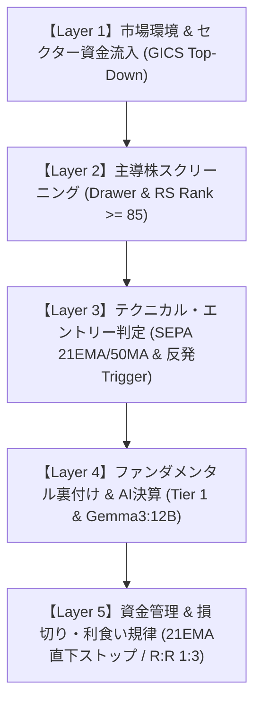

# kabu3.0 総合実戦トレード・プレイブック（体系的マスターガイド）

本ドキュメントは、kabu3.0に搭載された全機能（「⚡ 先行初動レーダー」「📊 GICSセクター資金流入」「SEPA 21EMA/50MA押し目スクリーナー」「個別銘柄AI決算分析」「リスク管理」）を統合し、**「実戦トレードにおいて何をどの順序で確認し、どのようにエントリー・損切り・利食いを執行すべきか」** を1枚に体系化したマスター手順書です。

---

## 目次
- [第1章: トレード哲学と5層ピラミッド構造](#第1章-トレード哲学と5層ピラミッド構造)
- [第2章: 【ステップ1】セクター資金流入の選定（トップダウン）](#第2章-ステップ1セクター資金流入の選定トップダウン)
- [第3章: 【ステップ2】構成銘柄ドロワーによる主導株スクリーニング](#第3章-ステップ2構成銘柄ドロワーによる主導株スクリーニング)
- [第4章: 【ステップ3】SEPA押し目状態バッジによるエントリー見極め](#第4章-ステップ3sepa押し目状態バッジによるエントリー見極め)
- [第5章: 【ステップ4】個別銘柄ページでのファンダメンタルズ＆AI決算確認](#第5章-ステップ4個別銘柄ページでのファンダメンタルズai決算確認)
- [第6章: 【ステップ5】リスク管理・損切り・利食い（資金管理の絶対規律）](#第6章-ステップ5リスク管理損切り利食い資金管理の絶対規律)
- [第7章: 実戦ケーススタディ（実データによるシミュレーション）](#第7章-実戦ケーススタディ実データによるシミュレーション)

---

## 第1章: トレード哲学と5層ピラミッド構造

### 1.1 なぜこのシステムで勝てるのか？
個人投資家が市場で敗北する最大の原因は、「主観的な当てずっぽう（逆張り・値頃感買い）」と「感情的な飛びつき買い（高値掴み）」です。
kabu3.0は、ウォール街の二大王道手法：
1. **機関投資家の大口資金フロー（バスケット買い・セクターローテーション）**
2. **マーク・ミネルヴィニ流 SEPA（Specific Entry Point Analysis: 構造的Stage 2 ＋ 押し目反発）**

を機械的かつ数学的に融合し、**「機関投資家が資金を注ぎ込んでいる最強セクターの中で、最もリスクリワード比が高い瞬間にだけエントリーする」** 仕組みを完全自動化しています。

### 1.2 5層ピラミッド構造（意思決定の階層）

トレードの成否の8割は **「どのセクターに資金が向かっているか」** で決まり、残りの2割が **「そのセクター内のどの銘柄を、どのタイミングで買うか」** で決まります。下層（銘柄当て）から始めるのではなく、必ず最上層（セクター資金流入）から順に降りていくことが鉄則です。

---

## 第2章: 【ステップ1】セクター資金流入の選定（トップダウン）

### 2.1 分類階層（4桁 vs 6桁）の使い分け
画面右上のトグルで **「GICS分類（Industry / Industry Group）」** を切り替えます。

- **4桁: Industry Group（約25業種グループ）**:
  - 用途: **大きな大口資金の潮流・構造的シフトの把握**。
  - 例: 「銀行」「保険」「半導体・半導体製造装置」「素材」など。マクロ経済や金利動向に連動する太い資金の流れを見るのに適しています。
- **6桁: Industry（約74業種）**:
  - 用途: **ピンポイントな局所テーマ・急伸業種の捕捉**。
  - 例: 「ガス」「無線通信サービス」「家庭用耐久財」など。特異なカタリストで動く中小型業種を特定するのに適しています。

### 2.2 2大エンジンの役割

1. **`[ ⚡ 先行初動レーダー ]`（先回り・初動検知）**:
   - 急騰する前の「水面下の商い急増（ステルス集積指数）」「出来高点火」「市場下落時の逆行耐性」「先導株先行アクション」を捉えます。
   - バックテスト実証: Q1（上位20%）銘柄は **保有期間中の最大逆行幅（MAE -5.35%）が市場平均（-6.34%）より大幅に浅い** 特徴があります。
2. **`[ 📊 トレンド確認 ]`（事後確認・モメンタム）**:
   - 売買代金シェア拡大、上昇銘柄比率（ブレッドス）、新高値集中度、超過RSなど、「すでに資金流入が定着した強い上昇トレンド」を確認します。

### 2.3 相場の進行段階（3段階ステータス）の狙い撃ちルール

フィルターボタンを使い、セクターが現在「相場のどの進行段階にあるか」を絞り込みます。

| 進行段階ステータス | 判定条件 | バックテスト実証（20日後） | 実戦でのアクション |
| :--- | :--- | :---: | :--- |
| **`⚡📊 初動＋トレンド一致`** (`both_confluent`) | 先行初動 Q1（上位20%） ＋ トレンド確認 Q1（上位20%） | **個別平均 +1.52%** **週平均 +1.71%** (勝率 67.5% / 95%CI [+0.98, +2.07]%) | **【最優先・本命ターゲット】** 初動からトレンドへの移行が完全に確認された最強領域。全力で銘柄精査を行う。 |
| **`⚡ 初動兆候`** (`early_only`) | 先行初動 Q1 のみ (トレンドはQ1圏外) | **個別平均 +1.18%** **MAE: -5.35%（最も浅い）** | **【先回り監視】** トレンドが目に見えて上昇する前の助走段階。逆行耐性が高く、下値リスクを抑えて仕込みたい場合に最適。 |
| **`📊 トレンド確認`** (`trend_only`) | トレンド確認 Q1 のみ (初動はQ1圏外) | **個別平均 +1.15%** MAE: -6.62% | **【順張り・押し目待ち必須】** すでに相場が走っているため、飛びつき買いは厳禁。21EMA/50MAまで引きつけた押し目のみを狙う。 |

---

## 第3章: 【ステップ2】構成銘柄ドロワーによる主導株スクリーニング

有力セクター（特に「初動＋トレンド一致」）を特定したら、該当行をクリックして **構成銘柄ドロワー** を開きます。
セクター内の全構成銘柄が一覧表示されます。

### 3.1 主導株（True Market Leaders）の抽出基準

同じセクター内でも、すべての銘柄が均等に上がるわけではありません。資金はまず**「そのセクターの看板株（主導株）」**に集中します。以下の優先度でソート・選定します：

1. **RSランク（レラティブ・ストレングス）**:
   - **RS 85〜95以上を最優先**: 市場全体の85%〜95%以上の銘柄をアウトパフォームしている主導株。セクター上昇時に真っ先に急騰します。
   - RS 70未満の出遅れ銘柄（ボロ株の逆張り）は原則として避ける。
2. **時価総額の選定**:
   - **中小型急成長株（時価総額 100億〜1,000億円）**: 最も大きな株価倍率（テンバガー等）が期待できるスウィートスポット。
   - **大型主導株（時価総額 300億〜3,000億円以上）**: 機関投資家の巨額資金が逃げ場として集まる本流銘柄（例：大手地銀、主要半導体等）。
3. **CLV（引け値位置）と出来高倍率**:
   - 当日の出来高が50日平均の1.5倍以上あり、CLVが 0.70 以上（高値引け）の銘柄は、大口の買い集め圧力が現在進行形で強い証拠です。

---

## 第4章: 【ステップ3】SEPA押し目状態バッジによるエントリー見極め

ドロワー最左列の「状態バッジ」は、銘柄が今 **「準備段階（Setup）」** なのか **「執行段階（Trigger）」** なのかを客観的に示します。

### 4.1 状態バッジの役割と投資判断マトリクス

| 状態バッジ | 物理判定条件 | トレードフェーズ | 実戦のアクション |
| :--- | :--- | :---: | :--- |
| **🟣 21EMA支持帯（調整中）** | ・構造的Stage 2（RS>=75） ・21EMA上向き ・高値から -3%〜-12% 浅押し ・21EMAから -1.5%〜+3.5% ・出来高枯渇比 $\le 75\%$ | **Setup（準備・監視）** | **【監視リストに入れて反発を待つ】** まだ下落途中・支持線テスト中。支持線を割り込むリスクがあるため、**この段階で素手で掴んではいけない（落ちてくるナイフを拾わない）**。 |
| **🔵 50日線支持帯（調整中）** | ・構造的Stage 2（RS>=75） ・高値から -5%〜-20% 押し ・50MAから -2.0%〜+3.5% ・出来高枯渇比 $\le 75\%$ | **Setup（準備・監視）** | **【本格押し目・反発待ち】** 機関投資家の重要防衛ライン（50日線）テスト中。出来高枯渇を確認しつつ、反発を待つ。 |
| **⚡ 反発確認（前日高値上抜け）** | ・支持帯（21EMAまたは50MA）上 ・**当日陽線**（終値 > 始値） ・**当日終値 > 前日高値** | **Trigger（売買執行）** | **【即座にエントリー執行】** 支持線で買い手が売り手を打ち負かした反発確定足。**損切りラインが確定したため、今すぐ成行または引け値で買う**。 |
| **―（通常）** | 支持帯・反発条件のいずれも未達 | 中立 | エントリー対象外。 |

### 4.2 なぜ「反発確認（前日高値上抜け）」を待つのか？
ミネルヴィニ流の極意は、**「最安値で買うこと」ではなく、「確認してから買うこと（Confirmation）」** です。
- 支持線にタッチしただけの段階では、そのまま下抜けてトレンド崩壊（Stage 4転落）するリスクが常に存在します。
- しかし、「当日陽線で前日高値を上抜けた」という事実は、**「支持線で買い支えが入り、短期的な下落モメンタムが上向きに転換した」という決定的な物理証拠**です。
- この確認を挟むことで、勝率が飛躍的に高まり、無駄な損切りを大幅に減らすことができます。

---

## 第5章: 【ステップ4】個別銘柄ページでのファンダメンタルズ＆AI決算確認

ドロワーの銘柄リンクをクリックして、個別銘柄ページ（`/stocks/[ticker]`）を開き、テクニカル候補の「中身の裏付け（業績の質）」を最終確認します。

### 5.1 SEPA / CAN-SLIM コア財務条件（Tier 1）の照合
ページ中段の決算・財務カードを確認します。

1. **売上高成長率（YoY）**:
   - **+10.0% 以上**（できれば +20% 以上の2桁成長）。
2. **EPS（1株当たり純利益）成長率（YoY）**:
   - **+20.0% 以上**、または **黒字転換（Turnaround）**。
   - ※株価が数倍に大化けするスーパーストックの約9割は、直近四半期でEPS +20%〜+50%以上の急拡大を記録しています。
3. **業績の加速（Acceleration）**:
   - 前四半期（例: 1Q +15% ➔ 2Q +28% ➔ 3Q +45%）のように、成長率が四半期を追うごとに加速していれば最高評価です。

### 5.2 AIアナリストレポート（Gemma3:12B）の読み解き方
ローカルLLMが直近の決算短信PDFから抽出したアナリストレポートをチェックします：

- **当期実績 (Current Performance)**:
  - 売上増や利益増の「中身」を確認（一過性の為替差益や資産売却ではなく、本業の需要拡大によるものか）。
- **次期見通し (Future Guidance)**:
  - 会社側ガイダンスが上方修正含みか、保守的すぎるリスク要因がないか。
- **前回比較 (Report Comparison)**:
  - 経営陣のトーン変化（「不確実性」や「減速」のワードが新たに浮上していないか）。

---

## 第6章: 【ステップ5】リスク管理・損切り・利食い（資金管理の絶対規律）

トレードで最も重要なのはエントリーではなく、**「負けたときにいくら失い、勝ったときにいくら残すか」というリスク管理**です。

### 6.1 逆指値損切りライン（Stop Loss）の厳格な設定
「⚡ 反発確認」でエントリーした瞬間、**同時に証券会社の逆指値注文（ストップロス）を必ず発注**します。

- **配置ルール**:
  - **第1基準**: **21日EMA（または50日SMA）のわずか下（-1.5%〜-2.0%水準）**。
  - **第2基準**: **反発を作った直近安値（前日または当日の最安値）の1〜2ティック下**。
- **最大許容リスク**:
  - 買値から **最大でも -3.0% 〜 -5.0% 以内** に必ず収める。
  - 1トレードあたりの損失額を、運用総資産の **1.0%〜2.0% 以内** に抑えるポジションサイズ計算を行う。

### 6.2 リスクリワード比（Risk-to-Reward Ratio: 1:3の原則）
- リスク（損切り幅）が **-3%** であれば、目標利益は **+9%〜+15%（1:3〜1:5）** に設定します。
- この比率を維持することで、**勝率が40%〜50%であっても、トータルの口座資金は右肩上がりに急増**します。

### 6.3 エグジット（利食い・手仕舞い）ルール
1. **初期上昇後のストップ引き上げ（ブレイクイーブン）**:
   - 株価が買値から +5%〜+7% 上昇したら、逆指値を買値（同値撤退ライン）まで引き上げ、**「負けのないトレード（Free Roll）」** に持ち込む。
2. **トレーリングストップ（21EMA追従）**:
   - 順調に上昇トレンドが継続している間は、終値ベースで **21日EMAを明確に下回るまで保有**し、利益を極限まで伸ばす。
3. **危険シグナルによる早期撤退**:
   - 出来高を伴う大陰線（ディストリビューション日）が連続して発生した場合は、反発を待たずにポジションの半分以上を機械的に利益確定する。

---

## 第7章: 実戦ケーススタディ（実データによるシミュレーション）

### ケース1: 4桁「銀行セクター」の押し目狙い撃ちシナリオ（実例）

1. **セクター選定**:
   - 画面で 4桁「Industry Group」、期間「20日」を選択。
   - フィルター `[ ⚡📊 初動＋トレンド一致 ]` を押す。
   - **「銀行」** が上位20%に合致し、初動＋トレンド一致のトップセクターとして抽出される。
2. **銘柄選定**:
   - 銀行行をクリックしてドロワーを開く。
   - RS列でソートすると、**筑波銀行 (8338, RS 96)**、**山陰合同銀行 (8381, RS 95)**、**いよぎんHD (5830, RS 93)**、**しずおかFG (5831, RS 92)** などの超強勢株が並ぶ。
3. **状態バッジの確認**:
   - これらはいずれも **🟣 `21EMA支持帯（調整中）`**。
   - 21EMAから乖離 -1.0%〜+0.9% のジャスト支持線上におり、高値からの押し幅は -3%〜-6% と極めて浅く、出来高も50日平均の40%〜60%まで綺麗に枯渇している。
4. **執行の待ち方**:
   - まだ支持線テスト中（調整中）なので、成行買いは我慢する。
   - 翌営業日にチャートを監視し、**「前日高値を上抜けて ⚡ 反発確認 が点灯した瞬間」** に成行エントリー。
   - 損切りラインを 21EMAの直下（約-2%下）に逆指値設定。
   - 目標利益を +8%〜+12% に置いて、リスクリワード 1:4 のトレードを執行する。

### ケース2: 失敗トレード時の規律的損切りシナリオ

1. 「⚡ 反発確認」が点灯したため、ある銘柄を 2,000円 でエントリー（損切りラインを21EMA直下の 1,940円 / -3.0% に設定）。
2. 翌日、地合いの急変により株価が下落し、21EMAを割り込んで 1,940円 に到達。
3. **「いつか戻るだろう」という希望的観測を100%排除し、逆指値が機械的に発火して即座に損切り（損失は資金全体の1%以内に限定）**。
4. 損切りした資金を温存し、次の「初動＋トレンド一致」の健全な反発銘柄へ直ちに資金を再配分する。

---

## チェックリスト（トレード前のセルフチェック）

エントリーボタンを押す前に、以下の5項目すべてにチェックが入るか確認してください：

- [ ] **1. セクター**: 4桁または6桁で「⚡📊 初動＋トレンド一致」または「⚡ 初動兆候」の上位セクターにあるか？
- [ ] **2. 相対強度**: 銘柄のRSランクは **85以上**（最低でも75以上）あるか？
- [ ] **3. 状態バッジ**: 調整中ではなく、**「⚡ 反発確認（前日高値上抜け）」** が物理的に点灯したか？
- [ ] **4. 損切り位置**: 21EMA直下または直近安値に逆指値を置いたとき、損失幅は **-5%以内（推奨-2〜-3%）** に収まるか？
- [ ] **5. 飛びつき排除**: ピボットまたは支持線からすでに大きく乖離してしまっていないか？

この5つの基準を忠実に守り続けることが、kabu3.0を使って相場で勝ち続けるための唯一絶対の道です。
